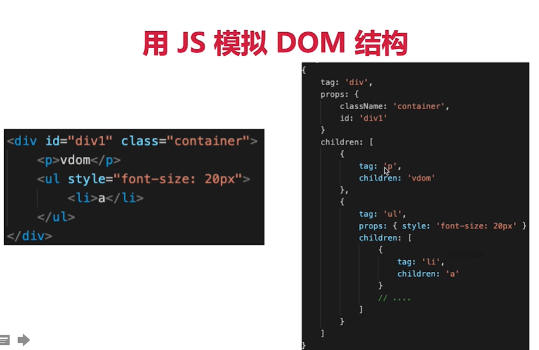

##### 创建Vue脚手架

    Vue脚手架最新是4.x

    Vue ： 1.x  2.x  3.x

    脚手架(Vue CLI[command line interface 命令行接口工具] )：1.x  2.x 3.x 4.x

    具体步骤：

   第一步（仅第一次执行）：全局安装@vue/cli

    npm install -g @vue/cli

   第二步：切换到你要创建的目录，然后使用命令创建项目

    vue create XXX

    第三步：启动项目

    npm run serve

    备注

    1，如果出现下载缓慢请配置npm淘宝镜像 npm config set registry http://registry.npm.taobao.org

    2,Vue脚手架隐藏了所有webpack相关的配置，如果想查看具体的webpack配置，请执行:vue inspect > output.js安装

http-server:  npm i http-server -g

启动http-server并设置端口号：http-server -p 1818

##### Vue MVVM 【重要考点】

    组件化

    数据驱动视图

    MVVM模型

##### Vue响应式

    组件data的数据一旦变化，立即出发视图的更新

    实现数据驱动视图的第一步

    考察Vue原理第一题

核心API Object.defineProperty

    Proxy 有兼容问题，且无法polyfill

    监听对象，监听数组

    复杂对象，深度监听

###### 几个缺点

    深度监听，需要递归到底，一次性计算量大

    无法监听新增属性/删除属性（Vue.set Vue.delete）

    无法原生监听数组，需要特殊处理

    Proxy兼容性不好，且无法polyfill

###### vue 如何监听数组变化

##### 虚拟DOM(Virtual DOM) 和 diff

    DOM操作非常耗费性能

    以前用jQuery，可以自行控制DOM操作的时机，手动调整

    Vue 和 React 是数据驱动视图，如何有效控制DOM操作？

解决方案---vdom

有了一定复杂度，想减少计算次数比较难

能不能把计算，更多的转移为JS计算？因为JS执行速度很快

VDOM  ---  用JS模拟DOM结构，计算出最小的变更，操作DOM

用JS模拟DOM结构

通过snabbdom学习vdom

简介强大的vdom库，易学易用

Vue参考它实现的vdom和diff

https://github.com/snabbdom/snabbdom

用JS模拟DOM结构（vnode）

新旧vnode对比，得出最小的更新范围，最后更新DOM

数据驱动视图的模式下，有效控制DOM操作

不足，不要乱说

    范围限定在技术方面

    非核心技术栈（）

    容易弥补的，后面才能"翻身"

反转话题

   回答模板： 我觉得自己在XX方面不足，但是我已经意识到了，并开始学习XX，我估计会在XX时间把这块补齐
